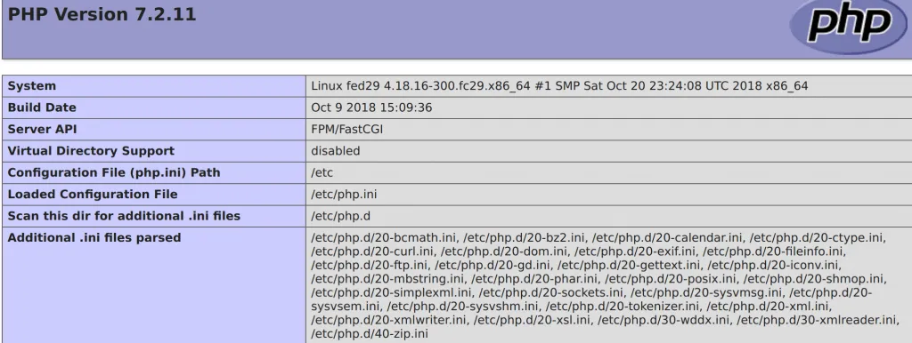

Retirado de https://computingforgeeks.com/how-to-install-lamp-stack-on-fedora/ em 07/06/2021.

# How To Install LAMP Stack on Fedora 34/33/32/31/30 | ComputingForGeeks

In this blog post, we will look at how to install and configure a LAMP Stack on Fedora 34/33/32/31/30. LAMP Stack is a collection of open-source tools that are used to host web applications. The LAMP stack acronym comprises of:

- **L –** Linux host system – Can be VM or physical, or a container
- **A –** Apache HTTP Server
- **M –** MySQL / MariaDB database
- **P –** PHP Programming language

To have a functional LAMP stack, you’ll need to install and configure each component one by one. The steps to install and configure LAMP Stack on Fedora 31/30/29 should be straightforward.

## Step 1: Install Fedora 34/33/32/31/30

The recent release of Fedora as of the writing of this article is Fedora. We have an installation guide which should work for the Physical server, a Virtual Machine and for Vagrant Box deployments:

[How to install Fedora on Physical Server / Virtual Environment](https://computingforgeeks.com/install-fedora-steps-with-screenshots/)

## Step 2: Install basic packages / set SELinux to Permissive

Install the basic packages like `vim`, `curl`, `wget`, `telnet`

```
$ sudo dnf -y update
$ sudo dnf -y install vim bash-completion curl wget telnet
```

If this is your first time to hear about SELinux, I advise you put it in Permissive mode or completely disable it. Check SELinux status by running:

```
$ sudo sestatus 
SELinux status:                 enabled
SELinuxfs mount:                /sys/fs/selinux
SELinux root directory:         /etc/selinux
Loaded policy name:             targeted
Current mode:                   enforcing
Mode from config file:          enforcing
Policy MLS status:              enabled
Policy deny_unknown status:     allowed
Memory protection checking:     actual (secure)
Max kernel policy version:      31
```

The default mode is `enforcing`. To put it in Permissive mode, execute:

```
$ sudo setenforce 0
$ sudo sed -i 's/^SELINUX=.*/SELINUX=permissive/g' /etc/selinux/config
```

To completely disable it:

```
$ sudo sed -i 's/^SELINUX=.*/SELINUX=disabled/g' /etc/selinux/config
```

Confirm persistent status configured

```
$ cat /etc/selinux/config | grep SELINUX=
# SELINUX= can take one of these three values:
SELINUX=permissive
```

## Step 3: Install Apache httpd server

Once you have Fedora OS installed and updated, proceed to install Apache httpd server.

```
$ sudo dnf -y install httpd
```

### Configure httpd basic settings:

Edit the configuration file `/etc/httpd/conf/httpd.conf` and set:

```
ServerAdmin admin@example.com
ServerName  example.com
ServerTokens Prod
```

You can optionally set Keepalive

```
KeepAlive On
```

Enable and start `httpd` service

```
$ sudo systemctl start httpd
$ sudo systemctl enable httpd
```

If you have firewalld running, allow `http` and `https` services.

```
$ sudo firewall-cmd --add-service={http,https} --permanent
$ sudo firewall-cmd --reload
```

## Step 4: Install PHP & Extensions

Install PHP and configure httpd to support execution of PHP scripts. Check our article on:

[How to Install PHP on Fedora](https://computingforgeeks.com/how-to-install-php-on-fedora/)

Don’t forget to install common extensions:

```
$ sudo dnf -y install php php-cli php-php-gettext php-mbstring php-mcrypt php-mysqlnd php-pear php-curl php-gd php-xml php-bcmath php-zip
```

Confirm your installed PHP version:

```
$ php -v
PHP 7.2.11 (cli) (built: Oct 9 2018 15:09:36) ( NTS )
Copyright (c) 1997-2018 The PHP Group
Zend Engine v3.2.0, Copyright (c) 1998-2018 Zend Technologies
```

Loaded extensions can be viewed by passing `-m` option to the `php` command

```
$ php -m
```

Set PHP timezone on the file `/etc/php.ini`

```
date.timezone = Africa/Nairobi
```

See a complete List of [Supported Timezones](https://php.net/manual/en/timezones.php).

## Step 4: Install MySQL / MariaDB Database

For installation of MySQL on Fedora, use our guide:

[How to install MySQL 8.0 on Fedora](https://computingforgeeks.com/how-to-install-mysql-8-on-fedora/)

Fedora upstream repositories have MariaDB which can be installed using the `dnf` command.

```
$ sudo dnf install mariadb-server
```

After the installation, set the character set

```
$ sudo vim /etc/my.cnf.d/mariadb-server.cnf
```

Set your character set under `[mysqld]` section

```
[mysqld]
character-set-server=utf8
```

Then start the `mariadb` service and enable it to start on boot

```
$ sudo systemctl start mariadb
$ sudo systemctl enable mariadb
```

Perform MariaDB initial settings like setting up a root password, disabling remote root login e.t.c:

```
$ sudo mysql_secure_installation 
NOTE: RUNNING ALL PARTS OF THIS SCRIPT IS RECOMMENDED FOR ALL MariaDB
      SERVERS IN PRODUCTION USE!  PLEASE READ EACH STEP CAREFULLY!

In order to log into MariaDB to secure it, we'll need the current
password for the root user.  If you've just installed MariaDB, and
you haven't set the root password yet, the password will be blank,
so you should just press enter here.

Enter current password for root (enter for none): 
OK, successfully used password, moving on...

Setting the root password ensures that nobody can log into the MariaDB
root user without the proper authorisation.

Set root password? [Y/n] y
New password: 
Re-enter new password: 
Password updated successfully!
Reloading privilege tables..
 ... Success!


By default, a MariaDB installation has an anonymous user, allowing anyone
to log into MariaDB without having to have a user account created for
them.  This is intended only for testing, and to make the installation
go a bit smoother.  You should remove them before moving into a
production environment.

Remove anonymous users? [Y/n] y
 ... Success!

Normally, root should only be allowed to connect from 'localhost'.  This
ensures that someone cannot guess at the root password from the network.

Disallow root login remotely? [Y/n] y
 ... Success!

By default, MariaDB comes with a database named 'test' that anyone can
access.  This is also intended only for testing, and should be removed
before moving into a production environment.

Remove test database and access to it? [Y/n] y
 - Dropping test database...
 ... Success!
 - Removing privileges on test database...
 ... Success!

Reloading the privilege tables will ensure that all changes made so far
will take effect immediately.

Reload privilege tables now? [Y/n] y
 ... Success!

Cleaning up...

All done!  If you've completed all of the above steps, your MariaDB
installation should now be secure.

Thanks for using MariaDB!
```

Answer questions like below:

- Enter current password for root (enter for none): **\<Enter\>**
- Set root password? [Y/n] **y**
- Remove anonymous users? [Y/n] **y**
- Remove test database and access to it? [Y/n] **y**
- Reload privilege tables now? [Y/n] **y**

Test login

```
$ mysql -u root -p
Enter password: 
Welcome to the MariaDB monitor.  Commands end with ; or \g.
Your MariaDB connection id is 16
Server version: 10.3.10-MariaDB MariaDB Server

Copyright (c) 2000, 2018, Oracle, MariaDB Corporation Ab and others.

Type 'help;' or '\h' for help. Type '\c' to clear the current input statement.

MariaDB [(none)]> select version();
+-----------------+
| version()       |
+-----------------+
| 10.3.10-MariaDB |
+-----------------+
1 row in set (0.001 sec)
```

Create and drop test database:

```
MariaDB [(none)]> CREATE DATABASE test_db;
Query OK, 1 row affected (0.001 sec)

MariaDB [(none)]> GRANT ALL PRIVILEGES ON test_db.* TO 'test_user'@'localhost' IDENTIFIED BY "StrongPassword";
Query OK, 0 rows affected (0.002 sec)

MariaDB [(none)]> FLUSH PRIVILEGES;
Query OK, 0 rows affected (0.001 sec)
```

To drop the database and user, use

```
MariaDB [(none)]> DROP DATABASE test_db;
Query OK, 0 rows affected (0.003 sec)

MariaDB [(none)]> DROP USER 'test_user'@'localhost';
Query OK, 0 rows affected (0.001 sec)
```

We have confirmed that our Database server is working fine. To allow for remote connections, allow port 3306 on the firewall

```
$ sudo firewall-cmd --add-service=mysql --permanent
$ sudo firewall-cmd --reload
```

You can also limit access from trusted networks

```
$ sudo firewall-cmd --permanent --add-rich-rule 'rule family="ipv4" \
service name="mysql" source address="10.1.1.0/24" accept'
```

## Step 5: Test your Lamp Stack Installation

As a test for our Lamp stack installation on Fedora 31/30/29, create a PHP test page

```
$ sudo vim /var/www/html/phpinfo.php
```

Add:

```php
<?php
// Show all information, defaults to INFO_ALL
phpinfo();
?>
```

Reload `httpd` service and open page on your browser.

```
$ sudo systemctl reload httpd
```

Open added PHP info page `http://[serverIP]/phpinfo.php`



That’s all. You have successfully installed LAMP stack on your Fedora 32/31/30/29 server or Desktop Workstation.